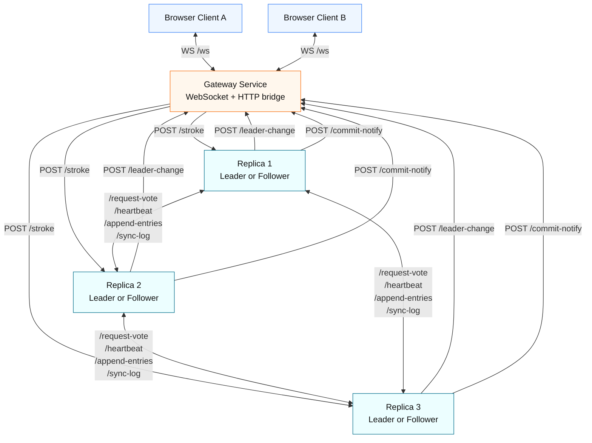

# Distributed Real-Time Drawing Board (Mini-RAFT)

A distributed collaborative drawing board built with:

- TypeScript + Node.js
- Express (internal RPC-style HTTP endpoints)
- WebSocket (gateway to browser clients)
- Docker Compose (multi-service local deployment)

The system uses a simplified Mini-RAFT implementation to elect a leader and replicate drawing strokes across replica nodes.

---

## 1) What this project does

Users draw on a shared canvas in the browser. Each stroke is:

1. sent to the Gateway over WebSocket,
2. forwarded to the current RAFT leader,
3. replicated to follower replicas,
4. committed after majority acknowledgement,
5. broadcast back to all connected clients.

Result: all users converge to the same committed canvas history, while the replica cluster can tolerate a single-node failure.

---

## 2) High-level architecture



---

## 3) Components

### Frontend

- Location: `apps/frontend/index.html`
- Provides a canvas and pointer-based drawing.
- Opens a WebSocket connection to the gateway (`/ws`).
- Displays:
  - committed strokes (cluster-approved),
  - pending strokes (optimistic local overlay).

### Gateway

- Location: `services/gateway/src/index.ts`
- Responsibilities:
  - maintain WebSocket client connections,
  - forward incoming strokes to current leader via HTTP,
  - receive commit notifications and broadcast committed events,
  - track leader changes.

### Replicas (Mini-RAFT)

- Location: `services/replica/src/raftNode.ts`
- Each replica can be in one of:
  - follower,
  - candidate,
  - leader.
- Responsibilities:
  - leader election (`/request-vote`),
  - heartbeat (`/heartbeat`),
  - log replication (`/append-entries`),
  - catch-up sync (`/sync-log`),
  - commit notification to gateway.

### Shared contracts

- Location: `packages/shared/src/index.ts`
- Contains all common TypeScript interfaces for RPC and WebSocket payloads.

---

## 4) Repository structure

```text
.
├── apps/
│   └── frontend/
│       └── index.html
├── packages/
│   └── shared/
│       └── src/index.ts
├── services/
│   ├── gateway/
│   │   └── src/index.ts
│   └── replica/
│       └── src/
│           ├── config.ts
│           ├── index.ts
│           └── raftNode.ts
├── docker-compose.yml
└── package.json
```

---

## 5) Step-by-step: run the project

## Prerequisites

- Docker Desktop (or Docker Engine + Compose plugin)
- Node.js 18+ and npm (for local workspace commands)

## Setup

1. Install workspace dependencies:

   ```bash
   npm install
   ```

2. Start all services:

   ```bash
   docker compose up --build
   ```

3. Open the drawing app:

   - Frontend UI: http://localhost:8080

4. Open the service health endpoints (optional):

   - Gateway health: http://localhost:3000/health
   - Gateway state: http://localhost:3000/state
   - Replica1 health: http://localhost:4001/health
   - Replica2 health: http://localhost:4002/health
   - Replica3 health: http://localhost:4003/health

5. Validate replication quickly:

   - Open two browser tabs at `http://localhost:8080`.
   - Draw in one tab.
   - Confirm committed strokes appear in both tabs.

## Stop

```bash
docker compose down
```

---

## 6) What is happening internally (runtime flow)

### A) Client draw path

1. Client sends `{ type: "stroke", stroke, localId }` to gateway over WebSocket.
2. Gateway forwards stroke to current leader via `POST /stroke`.
3. Leader appends stroke as a new log entry.
4. Leader sends `POST /append-entries` to followers.
5. After majority success, leader marks entry committed.
6. Leader sends `POST /commit-notify` to gateway.
7. Gateway broadcasts committed event to all clients.

### B) Election and failover path

1. Followers expect periodic heartbeats from leader.
2. If heartbeat times out, a follower becomes candidate.
3. Candidate increments term, votes for self, requests votes.
4. On majority votes, candidate becomes leader.
5. New leader notifies gateway via `POST /leader-change`.
6. Gateway routes new writes to the updated leader.

### C) Catch-up path

1. A lagging follower rejects append due to log mismatch/short log.
2. Leader gets follower log length from response.
3. Leader calls `POST /sync-log` with missing suffix entries.
4. Follower updates log and commit index, then rejoins normal flow.

---

## 7) Network ports and endpoints

## Ports

- Frontend (nginx): `8080`
- Gateway: `3000`
- Replica1: `4001`
- Replica2: `4002`
- Replica3: `4003`

## Gateway endpoints

- `GET /health`
- `GET /state`
- `POST /leader-change`
- `POST /commit-notify`
- `WS /ws`

## Replica endpoints

- `GET /health`
- `GET /debug/log`
- `POST /stroke`
- `POST /request-vote`
- `POST /heartbeat`
- `POST /append-entries`
- `POST /sync-log`

---

## 8) Common troubleshooting

- Frontend cannot connect:
  - ensure gateway is running on port 3000,
  - check browser console for WebSocket errors.

- Strokes not committing:
  - verify at least 2 replicas are healthy,
  - inspect `GET /health` on each replica for state/term info,
  - check gateway `GET /state` for current leader id.

- Services fail to start:
  - run `docker compose down` then `docker compose up --build` again,
  - ensure no local process is already using ports 3000/4001/4002/4003/8080.

---

## 9) Development notes

- This is a Mini-RAFT educational implementation, intentionally simplified.
- State is primarily in-memory; behavior across full restarts depends on current running cluster state.
- For a production-grade version, expected additions include durable storage, stronger leader discovery/retry behavior, and richer observability.
